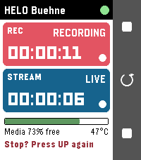
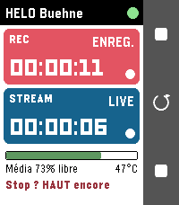
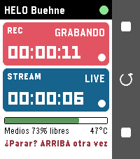
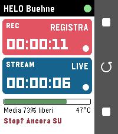
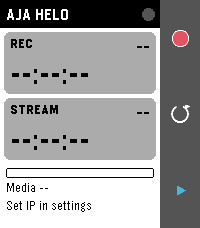
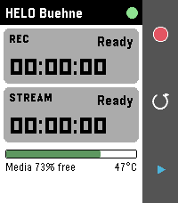
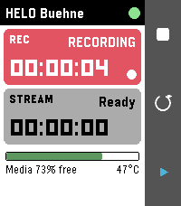
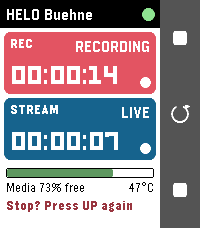
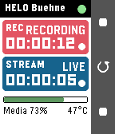
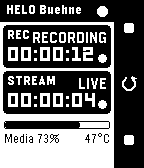

# HELO Remote – Pebble Time 2 App für den AJA HELO

Steuert und überwacht einen **AJA HELO** (H.264 Streaming-/Recording-Encoder) direkt vom
Handgelenk: Aufnahme und Stream starten/stoppen, Status, Laufzeit, freier Speicher und
Gerätetemperatur auf einen Blick.

Zielplattform ist die **Pebble Time 2** (`emery`, 200×228 Farbdisplay). Die App baut
zusätzlich für Pebble Time (`basalt`) und Pebble 2 / Core 2 Duo (`diorite`).

> **Status:** Version 1.1 (sieben Sprachen), baut warnungsfrei mit dem Pebble-SDK 4.33.1 für emery, basalt und
> diorite und läuft im Pebble-Emulator gegen den mitgelieferten HELO-Simulator
> (`tools/helo-simulator.js`), siehe [Screenshots](#screenshots-emulator). Das Store-Paket liegt
> fertig in `store/` ([Veröffentlichen](store/VEROEFFENTLICHEN.md)). Auf **echter Hardware**
> (Uhr + HELO) noch nicht getestet. Siehe [Bekannte Unsicherheiten](#bekannte-unsicherheiten).

---

## Funktionsweise

```
 Pebble Time 2  <-- Bluetooth / AppMessage -->  Pebble-App am Telefon (PebbleKit JS)  <-- HTTP (WLAN) -->  AJA HELO
   main.c                                            index.js                                     REST API :80
```

Die Uhr spricht nie direkt mit dem HELO. Der JavaScript-Teil in der Pebble-App auf dem Telefon
pollt die HELO-REST-API und schickt einen kompakten Status an die Uhr. Tastendrücke auf der Uhr
werden als Befehl ans Telefon geschickt und dort in `eParamID_ReplicatorCommand`-Requests übersetzt.

**Voraussetzung:** Das Telefon muss den HELO per HTTP erreichen (gleiches WLAN/VLAN, kein HTTPS).

### Verwendete HELO-REST-Parameter

| Parameter | Zweck |
|---|---|
| `eParamID_ReplicatorCommand` | `1` Rec Start · `2` Rec Stop · `3` Stream Start · `4` Stream Stop |
| `eParamID_ReplicatorRecordState` | `0` Init · `1` Idle · `2` Recording · `3/4` Failed · `5` Shutdown |
| `eParamID_ReplicatorStreamState` | analog für den Stream |
| `eParamID_RecordingDuration` / `eParamID_StreamingDuration` | Laufzeit (Timecode) |
| `eParamID_CurrentMediaAvailable` | freier Speicher in % |
| `eParamID_Temperature` | Gerätetemperatur in °C |
| `eParamID_SysName` | Gerätename für die Kopfzeile (optional, Fallback: IP) |
| `POST /authenticator/login` | Login, falls am HELO die Benutzer-Authentifizierung aktiv ist |

Requests: `http://<helo>/config?action=get&paramid=<id>` bzw. `...action=set&paramid=<id>&value=<n>`.

---

## Bedienung auf der Uhr

| Taste | Aktion |
|---|---|
| **Oben** | Aufnahme starten. Läuft sie: stoppen – **zweiter Druck innerhalb von 4 s** bestätigt. |
| **Mitte** | Status sofort aktualisieren (bricht eine offene Stopp-Bestätigung ab). |
| **Unten** | Stream starten / stoppen (gleiche Bestätigungslogik). |
| **Zurück** | App beenden. |

Anzeige:

- **Kopfzeile:** Gerätename, Verbindungspunkt (grün = OK, rot = HELO nicht erreichbar,
  gelb = Passwort falsch/fehlt, grau = noch keine Daten vom Telefon).
- **REC-Karte:** rot wenn Aufnahme läuft, orange bei Fehler, grau im Leerlauf; Laufzeit groß.
- **STREAM-Karte:** blau wenn live, sonst wie oben.
- **Fußzeile:** Balken „Medien xx % frei“ (rot < 10 %, orange < 25 %), Temperatur, Meldungen.
- **Aktionsleiste rechts:** zeigt je nach Zustand Start- oder Stopp-Symbol.

Die Uhr vibriert kurz bei Start, doppelt bei Stopp und lang bei einem Fehlerzustand
(abschaltbar in den Einstellungen).

---

## Einstellungen (Zahnrad in der Pebble-App)

Die Konfigurationsseite wird mit [Clay](https://github.com/pebble/clay) erzeugt:

- **IP-Adresse / Hostname** des HELO (Pflicht)
- **HTTP-Port** (Standard 80)
- **Passwort** – nur wenn am HELO *User Authentication* eingeschaltet ist
- **Abfrage-Intervall** 1–15 s (Standard 3 s)
- **Vibrieren bei Start/Stopp**
- **Sprache**: Automatisch (wie die Uhr) oder fest Deutsch, English, Français, Español,
  Italiano, Português, Nederlands
- Unter „Speichern“: Abschnitt **Unterstützen** mit Buy-me-a-coffee-Button
  (`src/pkjs/custom-clay.js` öffnet den Link im Browser des Telefons)

### Sprachen

Alle Texte auf der Uhr und die komplette Einstellungsseite gibt es in sieben Sprachen. Die
Telefon-Seite ermittelt die Sprache aus der Uhr (`Pebble.getActiveWatchInfo().language`), sonst
aus der Telefonsprache, sonst Englisch, und schickt den Index mit jedem Status als `LANGUAGE`
an die Uhr, damit beide Seiten dieselbe Tabelle verwenden. Zustandsnamen (Bereit, AUFNAHME,
LIVE, Fehler …) übersetzt die Uhr selbst; das Telefon liefert nur unbekannte Enum-Namen.

Einzige Quelle ist `tools/i18n.py`; `python3 tools/i18n.py` erzeugt `src/c/strings_i18n.h`
und `src/pkjs/i18n.js`. Neue Sprache: in `LANGS`, `NATIVE`, `W` und `P` ergänzen, generieren,
bauen.

| | | | |
|---|---|---|---|
|  Deutsch |  English |  Français |  Español |
|  Italiano |  Português |  Nederlands | |

---

## Bauen und installieren

Der Pebble-SDK-Workflow von Core Devices (Stand 2026):

```bash
# 1. Werkzeug installieren (einmalig)
uv tool install "pebble-tool==5.0.40" --python 3.13   # oder: pip install pebble-tool
pebble sdk install latest                             # installiert und aktiviert z.B. 4.33.1
pebble sdk list                                       # zeigt die aktive Version

# 2. Bauen
cd pebble-helo-remote
npm install            # holt pebble-clay
pebble build           # -> build/pebble-helo-remote.pbw (benannt nach dem Projektordner)

# 3. Installieren
pebble install --emulator emery        # Emulator Pebble Time 2
pebble install --phone <IP-des-Telefons>   # echte Uhr (Developer Connection in der Pebble-App aktivieren)
```

Logs des JS-Teils (hilfreich beim Einrichten): `pebble logs --phone <IP>`.

Verifiziert mit pebble-tool 5.0.40 und SDK 4.33.1 (GCC 14.2.1): `pebble build` läuft für alle
drei Plattformen ohne Warnungen durch. Der `wscript` setzt dafür `-Wl,--no-warn-rwx-segments`,
weil neuere binutils das vom SDK-Linkerskript erzeugte RWX-Segment sonst bemängeln.

### Emulator unter Linux (ohne Display)

- QEMU des SDK braucht `libsdl2-2.0-0` und `libpulse0` (Debian/Ubuntu: `apt install`).
- Ohne Monitor: `Xvfb :99 -screen 0 1280x800x24 &` und `export DISPLAY=:99`.
- In Containern ohne IPv6 scheitert die Telefon-Simulation `pypkjs` mit
  `[Errno 97] Address family not supported`. Abhilfe: in
  `site-packages/pypkjs/runner/websocket.py` das Bind-Tupel `("", self.port)` durch
  `("0.0.0.0", self.port)` ersetzen.
- Einstellungen lassen sich ohne Clay-Seite direkt in den localStorage des Emulators schreiben
  (`~/.local/share/pebble-sdk/<SDK>/<plattform>/localstorage/<app-uuid>`, Format `dbm.dumb`,
  Schlüssel `helo_remote_settings`, Wert JSON wie `{"host":"127.0.0.1","port":8080,"poll":2}`).
- Tasten: `pebble emu-button --emulator emery click up|select|down|back`;
  Screenshot: `pebble screenshot --emulator emery --no-open datei.png`.

### Ohne Hardware testen

```bash
node tools/helo-simulator.js 8080                    # ohne Passwort
node tools/helo-simulator.js 8080 --password geheim  # mit Login
```

Automatischer Test des JS-Teils gegen den Simulator (startet ihn selbst):

```bash
node tools/test-pkjs.js                      # ohne Auth
SIM_PASSWORD=geheim node tools/test-pkjs.js  # inkl. Login-Flow
```

Danach in den App-Einstellungen die IP des Rechners und Port `8080` eintragen. Der Simulator
führt eine kleine Zustandsmaschine (Rec/Stream, Laufzeit, 73 % Speicher, 47 °C) und loggt alle
Requests.

---

## Screenshots (Emulator)

Aufgenommen mit `pebble screenshot` gegen den HELO-Simulator, auf Englisch für die
Store-Listung; dieselben fünf Motive liegen für alle drei Plattformen in
`store/screenshots_<plattform>/`. Emery = Pebble Time 2:

| Keine IP konfiguriert | Bereit | Aufnahme läuft | Aufnahme + Stream | Stopp-Bestätigung |
|---|---|---|---|---|
|  |  |  |  |  |

| Basalt (Pebble Time) | Diorite (Pebble 2) |
|---|---|
|  |  |

Einstellungsseite (Clay) in der Pebble-App: [docs/einstellungen_clay.png](docs/einstellungen_clay.png)

---

## Projektstruktur

```
pebble-helo-remote/
├── package.json              Pebble-Projekt (Plattformen, messageKeys, Clay-Abhängigkeit)
├── package-lock.json         festgepinnte Clay-Version
├── wscript                   Standard-Buildskript des Pebble-SDK (+ Linker-Flag, s. o.)
├── docs/                     Screenshot der Clay-Einstellungsseite
├── store/                    Store-Paket: Icons, Banner, Screenshots, Texte, Anleitung (siehe store/README.md)
├── src/c/main.c              Watch-App: UI, Tasten, AppMessage
├── src/pkjs/index.js         Phone-Seite: HELO-REST-Polling, Befehle, Auth, Clay
├── src/c/strings_i18n.h      Uhr-Texte in 7 Sprachen (generiert)
├── src/pkjs/config.js        Clay-Konfigurationsseite, je Sprache gebaut
├── src/pkjs/custom-clay.js   Buy-me-a-coffee-Button auf der Konfigurationsseite
├── src/pkjs/i18n.js          Telefon-Texte in 7 Sprachen (generiert)
├── tools/i18n.py             einzige Quelle aller Übersetzungen, erzeugt die beiden Dateien oben
├── resources/images/menu_icon.png
├── tools/helo-simulator.js   HELO-REST-Simulator für Tests
└── tools/test-pkjs.js        Integrationstest Phone-Seite gegen den Simulator
```

### Nachrichtenprotokoll (AppMessage)

Uhr → Telefon: `CMD` = 0 Refresh, 1 Rec Start, 2 Rec Stop, 3 Stream Start, 4 Stream Stop.

Telefon → Uhr: `CONN` (0 unbekannt, 1 OK, 2 offline, 3 Auth-Fehler, 4 keine IP konfiguriert),
`REC_STATE`, `REC_NAME`, `REC_DUR`, `STREAM_STATE`, `STREAM_NAME`, `STREAM_DUR`, `MEDIA_PCT`,
`TEMP_C`, `SYS_NAME`, `MESSAGE`, `VIBRATE`, `LANGUAGE` (0 auto, 1–7 = de en fr es it pt nl).
`REC_NAME`/`STREAM_NAME` sind für die bekannten Zustände 0–5 leer, die Uhr übersetzt sie selbst.

---

## Bekannte Unsicherheiten

- **Nicht auf Hardware getestet.** Build (SDK 4.33.1) und Emulator sind verifiziert: Status,
  Rec/Stream-Start und -Stopp inkl. Bestätigung, Medien-/Temperaturanzeige laufen gegen den
  Simulator. Offen bleibt der Test mit echter Uhr und echtem HELO (`pebble install --phone <IP>`,
  dann Logs mit `pebble logs --phone <IP>` prüfen).
- **Kleine Displays (basalt/diorite, 144×168):** Laufzeit in LECO 20 statt 26 und „Medien xx %“
  ohne „frei“, damit alles in die Breite passt. Die Stopp-Bestätigung „Stopp? Nochmal OBEN/UNTEN“
  wird dort noch mit „…“ gekürzt, auf emery ist sie vollständig lesbar.
- **Übersetzungen** sind maschinell geprüft, aber nicht von Muttersprachlern gegengelesen.
  Korrekturen gehören in `tools/i18n.py`. Der Store selbst ist einsprachig (Englisch).
- `eParamID_SysName` ist aus der Ki-Pro-API übernommen; liefert der HELO ihn nicht, zeigt die
  Kopfzeile einfach die IP.
- `value_name` der Zustände wird am HELO als Enum-Name geliefert (z. B. `eRRSRecording`). Die
  App übersetzt die bekannten Zahlenwerte 0–5 in deutsche Kurzlabels und zeigt sonst den
  bereinigten Enum-Namen.
- Bei aktivierter Authentifizierung hängt das Cookie-Handling von der JS-Laufzeit der
  Pebble-App ab (iOS/Android). Die App versucht beides: Cookie automatisch und manuell mitzusenden.
- HELO **Plus** nutzt dieselben Replicator-Parameter; Multi-Stream-Laufzeiten
  (`eParamID_Stream1_Duration`, `eParamID_Stream2_Duration`) sind noch nicht eingebunden.

## Ideen für später

- Aufnahme-/Streaming-Profil (`eParamID_RecordingProfileSel`, `eParamID_StreamingProfileSel`) per
  Long-Press wählen
- Mehrere HELOs (Bühne / Probebühne) umschalten
- Timeline-Pins bei Start/Stopp

## Lizenz

Wie das umgebende Repository (siehe `../LICENSE.md`).
