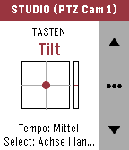
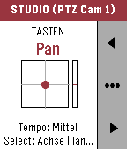
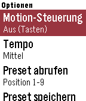
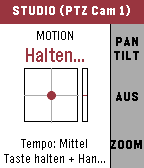
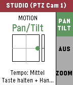
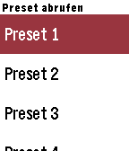
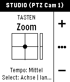

# NDI PTZ Remote für Pebble Time 2

Steuere NDI-PTZ-Kameras direkt vom Handgelenk: Pan, Tilt, Zoom, Fokus und
Presets über die Tasten der Uhr **oder** per Bewegungssteuerung, indem du das
Handgelenk neigst.

```
┌────────────┐   Bluetooth    ┌─────────────────┐    HTTP (WLAN)    ┌────────────────────┐   NDI    ┌────────────┐
│ Pebble     │ ─────────────► │ Pebble-App      │ ────────────────► │ ndi_ptz_bridge.py  │ ───────► │ PTZ-Kamera │
│ Time 2     │  AppMessage    │ (PebbleKit JS)  │  REST/JSON        │ (PC im Netzwerk)   │  SDK     │ (NDI|HX)   │
└────────────┘                └─────────────────┘                   └────────────────────┘          └────────────┘
```

Die Uhr selbst hat kein WLAN und kein NDI. Deshalb läuft auf einem Rechner im
Produktionsnetz eine kleine **Bridge** (ein einzelnes Python-Skript, nur
Standardbibliothek), die das NDI-SDK anspricht. Die Pebble-App auf dem Handy
reicht die Befehle der Uhr per HTTP an die Bridge weiter.

## Ordnerstruktur

| Pfad | Inhalt |
|------|--------|
| `package.json`, `wscript` | Pebble-Projekt (SDK 3, Plattformen `emery` = Pebble Time 2, `basalt`, `diorite`) |
| `src/c/` | Watch-App in C (Kameraliste, Steuerfenster, Optionen, Bewegungssteuerung, AppMessage-Transport) |
| `src/pkjs/index.js` | Phone-Seite (PebbleKit JS): AppMessage ⇄ HTTP |
| `src/pkjs/config.js` | Konfigurationsseite (Clay): Bridge-Adresse, Tempo, Achsen umkehren, Empfindlichkeit |
| `bridge/ndi_ptz_bridge.py` | NDI-PTZ-Bridge mit REST-API, Watchdog, Mock-Modus und Browser-Testseite |

## 1. Bridge einrichten

Auf einem Rechner, der im selben Netz wie die Kameras **und** das Handy ist:

1. [NDI Tools / NDI Runtime](https://ndi.video/tools/) installieren (die Bridge lädt
   `Processing.NDI.Lib.x64.dll` bzw. `libndi.so` / `libndi.dylib` per ctypes).
   Ist bereits ein NDI-SDK installiert, reicht das.
2. Python 3.8 oder neuer.
3. Starten:

   ```bash
   python bridge/ndi_ptz_bridge.py
   ```

   Ohne NDI-Installation zum Ausprobieren:

   ```bash
   python bridge/ndi_ptz_bridge.py --mock
   ```

4. Im Browser `http://<IP-des-Rechners>:8765/` öffnen. Dort gibt es eine kleine
   Testseite mit Steuerkreuz. Wenn die Kamera darüber fährt, ist die NDI-Seite fertig.

Nützliche Optionen:

| Option | Bedeutung |
|--------|-----------|
| `--port 9000` | anderer Port (Standard 8765) |
| `--extra-ips 10.0.0.12,10.0.0.13` | NDI-Discovery über Subnetz-Grenzen |
| `--groups Regie` | NDI-Gruppen (Standard: public) |
| `--ptz-only` | Quellen ohne PTZ-Unterstützung ausblenden |
| `--watchdog 1.5` | Kamera stoppen, wenn so viele Sekunden kein Fahrbefehl mehr kommt |
| `--ndi-lib /pfad/libndi.so` | Bibliothek explizit angeben |
| `-v` | ausführliches Logging (jeder HTTP-Request) |

### REST-API (falls du sie anderweitig nutzen willst, z. B. aus Companion/Bitfocus)

```
GET  /api/cameras[?refresh=1]              -> {"cameras":[{"id":0,"name":"...","ptz":true}]}
POST /api/cameras/<id>/move                {"pan":-1..1,"tilt":-1..1,"zoom":-1..1}   (alles 0 = Stopp)
POST /api/cameras/<id>/stop
POST /api/cameras/<id>/preset/<n>/recall   [{"speed":0..1}]
POST /api/cameras/<id>/preset/<n>/store
POST /api/cameras/<id>/home
POST /api/cameras/<id>/autofocus
POST /api/cameras/<id>/focus               {"speed":-1..1}
POST /api/stop_all
GET  /api/status
```

## 2. Watch-App bauen und installieren

Fertig gebaut liegt die App unter [`dist/ndi-ptz-remote.pbw`](dist/ndi-ptz-remote.pbw)
(Emery, Basalt, Diorite). Auf dem Handy öffnen (z. B. per Download-Link oder
AirDrop), die Pebble-App übernimmt die Installation. Alternativ selbst bauen:


Voraussetzung: das aktuelle Pebble-SDK von Core Devices
(`uv tool install pebble-tool` und `pebble sdk install latest`, siehe
[developer.repebble.com](https://developer.repebble.com)).

```bash
cd pebble-ndi-ptz
pebble build
pebble install --phone <IP-deines-Handys>     # Developer Connection in der Pebble-App aktivieren
# oder im Emulator:
pebble install --emulator emery
```

Beim Build wird `pebble-clay` automatisch per npm installiert (steht in `package.json`).

## 3. Konfigurieren

In der Pebble-App auf dem Handy: **NDI PTZ Remote → Einstellungen (Zahnrad)**.

- **Host / IP der Bridge** und **Port** (z. B. `192.168.1.50`, `8765`)
- **Standard-Tempo** Langsam / Mittel / Schnell (30 / 60 / 100 % der Kameramaximalgeschwindigkeit)
- **Pan / Tilt umkehren**, falls die Richtung nicht zu deiner Intuition passt
- **Empfindlichkeit** der Bewegungssteuerung: 1 = grosse Handbewegung nötig (≈ 45°), 10 = sehr feinfühlig (≈ 9°)
- **Totzone** in Prozent, damit die Kamera bei ruhiger Hand wirklich steht

## 4. Bedienung

### Kameraliste
Beim Start fragt die Uhr die Bridge nach allen NDI-Quellen. PTZ-fähige stehen oben.

| Taste | Aktion |
|-------|--------|
| Hoch / Runter | Kamera wählen |
| Select | Kamera öffnen |
| Select lang | NDI-Discovery neu starten |

### Steuerfenster, Tastenmodus (Standard)

| Taste | Aktion |
|-------|--------|
| Hoch / Runter **halten** | Fahren entlang der aktuellen Achse, loslassen = Stopp |
| Select | Achse wechseln: Tilt → Pan → Zoom → Fokus |
| Select lang | Optionen (Motion an/aus, Tempo, Presets, Home, Autofokus, neu suchen) |
| Zurück | Stopp und zurück zur Liste |

Die Leiste rechts zeigt, was Hoch/Runter gerade tun (▲▼, ◄►, +/−, FERN/NAH).

### Steuerfenster, Motion-Modus (Handgelenk)

Einschalten über *Select lang → Motion-Steuerung*.

| Taste | Aktion |
|-------|--------|
| **Hoch halten** | Pan/Tilt folgen dem Handgelenk: Handgelenk nach links/rechts drehen = Pan, Oberkante der Uhr nach unten/oben kippen = Tilt |
| **Runter halten** | Zoom folgt dem Handgelenk: Oberkante nach unten kippen = hineinzoomen, nach oben = herauszoomen |
| Select | zurück in den Tastenmodus |
| Select lang | Optionen |

Im Moment des Drückens wird die aktuelle Haltung als Nullpunkt genommen. Du
kannst die Uhr also in jeder bequemen Position halten und musst nicht
"waagrecht" anfangen. Je weiter du kippst, desto schneller fährt die Kamera
(mit einer leichten Expo-Kurve für Feinarbeit nahe der Mitte). Loslassen
stoppt sofort. Die Uhr vibriert kurz, wenn die Steuerung greift.

Der Kasten in der Mitte zeigt live die Neigung (bzw. im Tastenmodus die
gesendete Pan/Tilt-Geschwindigkeit), der Balken rechts daneben den Zoom.

## Sicherheit gegen "durchdrehende" Kameras

Eine Live-Kamera darf nie unkontrolliert weiterfahren. Deshalb gibt es drei Netze:

1. **Totmannschalter**: Bewegung nur, solange eine Taste gehalten wird. Loslassen,
   Fensterwechsel, Benachrichtigung oder Zurück senden sofort Stopp.
2. **Keepalive**: Während einer Fahrt wiederholt die Uhr den Befehl alle 0,5 s.
3. **Watchdog in der Bridge**: Kommt 1,5 s kein Fahrbefehl mehr (Bluetooth weg,
   Handy aus, WLAN weg), stoppt die Bridge die Kamera selbst.

Ein fehlgeschlagener Stopp-Befehl wird sowohl von der Uhr als auch vom Handy
wiederholt.

## Gyro oder Beschleunigungssensor?

Das Pebble-SDK stellt Apps den **Beschleunigungssensor** (und den Kompass)
bereit, keinen rohen Gyroskop-Datenstrom. Für eine Kamerasteuerung ist das
sogar die bessere Wahl: Der Beschleunigungssensor misst über die Erdanziehung
die *absolute* Neigung des Handgelenks. Eine feste Neigung ergibt eine
konstante Kamerageschwindigkeit, und Handgelenk gerade halten heisst Kamera
steht. Ein Gyroskop würde nur Drehraten liefern und wegdriften. Die App
filtert die Rohdaten (50 Hz, Tiefpass) und ignoriert Samples während der
Vibration.

## Teststand

Was bisher verifiziert wurde (Stand: Entwicklung, ohne echte Hardware):

| Ebene | Test | Ergebnis |
|-------|------|----------|
| Watch-App | Vollständiger `pebble build` (SDK aus PebbleOS `main` generiert) für emery, basalt, diorite | ✅ baut ohne Warnungen, `pebble-ndi-ptz.pbw` |
| Watch-App | Läuft im Pebble-Emulator (basalt + diorite, echte Firmware in QEMU) | ✅ |
| Ende-zu-Ende | Emulator → PebbleKit JS (pypkjs) → HTTP → Mock-Bridge: Kameraliste, Tasten-Fahrbefehle mit Keepalive und Stopp, Achsenwechsel, Zoom, Fokus | ✅ |
| Ende-zu-Ende | Motion-Modus mit simuliertem Beschleunigungssensor (`pebble emu-accel`): Pan/Tilt und Zoom, Nullpunkt beim Drücken, Stopp beim Loslassen | ✅ |
| Ende-zu-Ende | Optionen: Tempo, Preset abrufen, Home, Autofokus, Kameras neu suchen | ✅ |
| Bridge | REST-API, Koaleszieren, Watchdog, chunked Bodies, ungültiges JSON → 400 | ✅ (Mock-Modus) |
| Bridge | Echte NDI-PTZ-Kamera über NDI-SDK | ⏳ noch nicht getestet, ctypes-Bindung folgt der NDI-SDK-Dokumentation (v5/v6) |
| Watch-App | Auf echter Pebble Time 2 (emery) | ⏳ noch nicht getestet; der emery-Emulator der alten Robert-Hardware ist im aktuellen QEMU nicht portiert |

### Screenshots (Emulator, basalt 144×168; die Time 2 hat 200×228)

| Kameraliste | Tastenmodus Tilt | Tastenmodus Pan | Optionen |
|---|---|---|---|
|  |  |  |  |

| Motion bereit | Motion aktiv (Pan/Tilt) | Presets | Diorite (s/w) |
|---|---|---|---|
|  |  |  |  |

### Selbst im Emulator testen

```bash
python bridge/ndi_ptz_bridge.py --mock            # Terminal 1
pebble build && pebble install --emulator basalt  # Terminal 2
pebble emu-app-config --emulator basalt           # Bridge-Host 127.0.0.1 eintragen
pebble emu-button --emulator basalt click select  # Kamera öffnen
pebble emu-button --emulator basalt push up; sleep 1; pebble emu-button --emulator basalt release up
pebble emu-accel --emulator basalt tilt-right     # Handgelenk simulieren (im Motion-Modus)
pebble screenshot --emulator basalt
```

Die Bridge protokolliert jeden Befehl; mit `-v` auch jeden HTTP-Request.

## Fehlersuche

| Anzeige auf der Uhr | Ursache / Lösung |
|---------------------|------------------|
| *Bridge nicht konfiguriert* | Host/IP in den App-Einstellungen eintragen |
| *Bridge nicht erreichbar* | Bridge gestartet? Handy im selben WLAN? Firewall auf dem Bridge-Rechner blockiert Port 8765? Testseite im Handy-Browser öffnen: `http://<IP>:8765/` |
| *Keine Antwort vom Handy* | Pebble-App auf dem Handy läuft nicht / Bluetooth getrennt |
| *Keine PTZ-Kameras* | Bridge sieht keine NDI-Quellen: gleiches Subnetz? Sonst `--extra-ips`. Mit `--mock` prüfen, ob der Rest funktioniert |
| Kamera als *kein PTZ* gelistet | Quelle meldet keine PTZ-Fähigkeit (z. B. OBS, Bildmischer). Bei echten PTZ-Kameras: NDI-Firmware aktualisieren, `--capability-wait 5` probieren |
| Richtung falsch | *Pan/Tilt umkehren* in den Einstellungen |
| Kamera zuckt bei ruhiger Hand | *Totzone* erhöhen oder *Empfindlichkeit* senken |

## Technische Notizen

- AppMessage-Schlüssel und Befehlscodes sind in `src/c/ptz_app.h` und
  `src/pkjs/index.js` definiert und müssen zusammenpassen.
- Die Uhr sendet Bewegungswerte als ganze Zahlen −100..100, das Handy
  skaliert auf −1..1 für die NDI-API (`NDIlib_recv_ptz_pan_tilt_speed`,
  `NDIlib_recv_ptz_zoom_speed`).
- Pro Kamera hält die Bridge einen NDI-Receiver mit `metadata_only`-Bandbreite
  offen (kein Videostream), weil PTZ-Befehle nur über eine bestehende
  Empfängerverbindung gesendet werden können.
- Bewegungsupdates werden auf beiden Seiten koalesziert: Es ist immer nur eine
  Nachricht bzw. ein HTTP-Request unterwegs, und der neueste Wert gewinnt.
