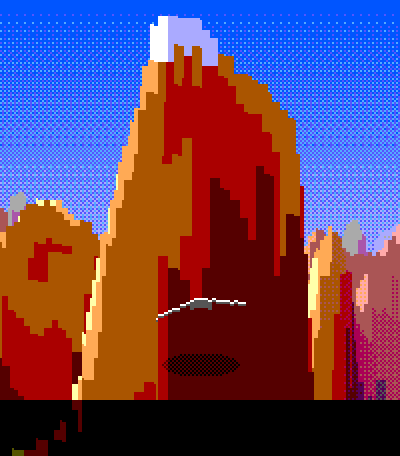
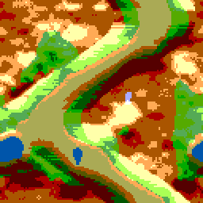
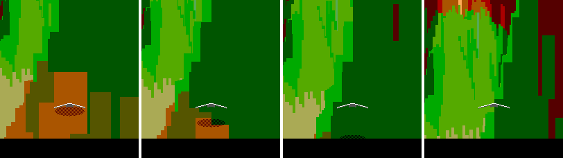
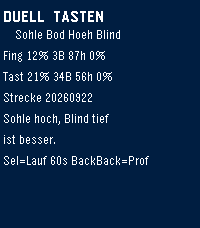
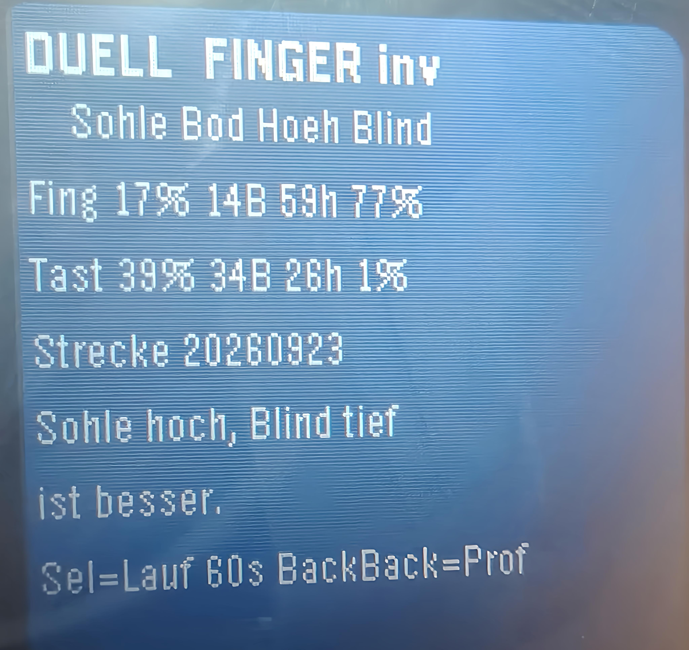
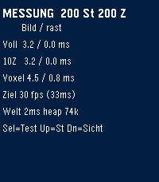
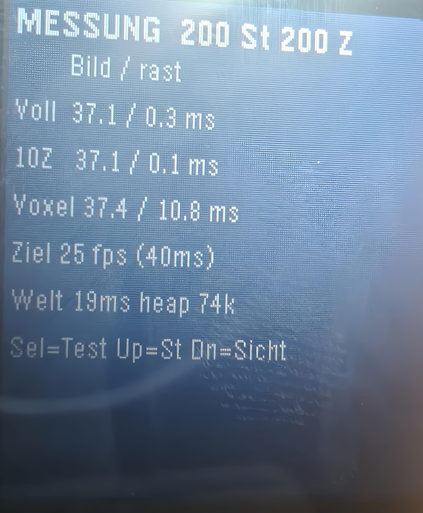

# BODENEFFEKT, Phase 1: Voxel-Space-Renderer fuer die Pebble Time 2

Baubares Pebble-Projekt (C, SDK 4.33.1, Plattform `emery`) mit dem Kern aus
Phase 1 des Konzeptpapiers [`KONZEPT.md`](KONZEPT.md): ein
Comanche-Voxel-Renderer direkt im 8-Bit-Framebuffer, eine prozedurale Welt aus
einem Seed, Distanz-Nebel mit Bayer-Dithering, Roll ueber Horizontverschiebung,
und von Anfang an die Messung, die darueber entscheidet, ob das Konzept mit
30 Bildern pro Sekunde rechnen darf.



Noch nicht dran, bewusst: Ton, Tore, Missionen, Tageszeit-Varianten,
Telefon-Anbindung, Backlight-Grading, Haptik.

## Zuerst messen, dann bauen

Die wichtigste offene Frage des Konzepts ist nicht der Rasterizer, sondern die
Panel-Uebertragung. Die vollstaendige Anleitung dazu steht in
[`docs/messung-zuerst.md`](docs/messung-zuerst.md). Kurzfassung:

- `graphics_release_frame_buffer` meldet **immer den ganzen Puffer** als
  schmutzig, und der Compositor ruft ohnehin `framebuffer_dirty_all`. Der im
  Konzept geplante Dirty-Row-Trick spart Rechenzeit, aber keine Uebertragung.
- Die Bildausgabe laeuft auf KernelMain, also ueber der App **und ueber dem
  Audio-Nachschub**, der eine harte 32-ms-Frist ohne Reserve hat. Jedes Bild
  pro Sekunde geht spaeter dem Ton vom Teller.
- Der Emulator misst das nicht: dort kostet ein Vollbild rund 3 ms, das ist
  QEMU, nicht das JDI-Panel.

Deshalb hat dieses Projekt einen eigenen Messbildschirm, und
`pebble/schwebung` (Bildschirm PANEL) liefert dieselbe Zahl unabhaengig vom
Spiel. **Die Messung ist inzwischen gelaufen**, siehe unten: sie widerlegt die
30 fps des Konzepts, bestaetigt den Quellenbefund zum Dirty-Row-Trick und
verschenkt dem Spiel dafuer fast 30 ms Rechenzeit pro Bild.

## Bauen und installieren

**Nur messen, ohne Entwicklungsrechner:** `build/bodeneffekt.pbw` mit der
Pebble-App auf dem Telefon oeffnen, die installiert auf die Uhr. Der
Messbildschirm zeigt alle Ergebnisse selbst an; ein Log ist dafuer nicht noetig.

```bash
uv tool install pebble-tool        # einmalig
pebble sdk install latest          # einmalig (getestet mit 4.33.1)
pebble build
pebble install --emulator emery    # Emulator: prueft nur Lauffaehigkeit
pebble login                       # einmalig, fuer die CloudPebble-Verbindung
pebble install --cloudpebble --logs | tee bodeneffekt.log   # echte Uhr
```

Zeigt die Pebble-App unter Developer Connection keine IP, sondern nur
"connected to CloudPebble", ist das der Normalfall: dann gilt `--cloudpebble`
(bzw. `--phone` ohne IP), und `--phone <IP>` waere falsch.

Im kopflosen Container braucht QEMU einen Wrapper, der `-display` und `-audio`
aus den Argumenten entfernt und `-display none` anhaengt, gesetzt ueber
`PEBBLE_QEMU_PATH`, dazu `NO_PROXY=localhost,127.0.0.1`. Bindet der
JS-Simulator `pypkjs` auf einem System ohne IPv6, schlaegt sein WSGI-Server
mit `Address family not supported by protocol` fehl und `pebble install`
meldet nur `[Errno 111] Connection refused`; dann muss der Server auf
`127.0.0.1` statt auf `""` gebunden werden.

## Bedienung

| Taste | FLUG | MESSUNG |
|---|---|---|
| Back kurz | zu MESSUNG | zu DUELL (von dort zu FLUG) |
| Back Doppelklick | Steuerprofil umschalten | Steuerprofil umschalten |
| Back lang (900 ms) | App beenden | App beenden |
| Select halten | steigen (Tasten) / Praezision (Finger) | — |
| Select kurz | — | Test starten, Variante weiterschalten (DUELL: 60-s-Lauf) |
| Select Doppelklick | — | Nicklage der Fingersteuerung umkehren |
| Up / Down | Roll (Tasten) / Hoehentrimmung (Finger) | Strahlenzahl / Sichtweite |

### Die beiden Steuerprofile, und warum sie beide drin sind

Die Jury hat den Fingerstick mit 6,9 von 10 bewertet und dabei einen konkreten
Vorwurf erhoben: beim Steigen zieht die Fingerkuppe aus dem Cockpitband bis an
die Horizontlinie und verdeckt genau den Bodenschatten, also die wichtigste
Information des Spiels. Der Tastenmodus mit Flappy-Hoehenmodell koennte die
bessere Steuerung sein, was fuer ein Touch-Konzept ein schlechtes Zeichen ist.

Diese Frage wird hier nicht entschieden, sondern messbar gemacht:

- **Profil A, Fingerstick.** Finger irgendwo aufsetzen, der Versatz zum
  Aufsetzpunkt ist die Eingabe (x = Roll, y = Hoehe). Dead Zone 6 px,
  Saettigung bei 40 px, quadratische Kurve. Loslassen = Neutrallage.
- **Profil B, Tasten.** Up/Down = Roll, Select gehalten = steigen, sonst
  sinken (Flappy-Hoehenmodell).
- **Ein Doppelklick auf Back tauscht die Profile mitten im Flug**, ohne
  Neustart und ohne Menue. Nur so lassen sich zwei Laeufe hintereinander
  ehrlich vergleichen.
- **Der Bildschirm DUELL macht den Vergleich zur Messung** statt zur
  Geschmacksfrage, siehe unten.
- **Die Nicklage ist standardmaessig umgekehrt** (Doppelklick Select auf dem
  Messbildschirm schaltet um). Ziehen nach unten heisst steigen, wie an einem
  echten Knueppel. Damit wandert der Finger beim Steigen vom Horizont **weg**
  statt auf ihn zu, und der Einwand der Jury greift genau dann nicht mehr.
  Ob das reicht, entscheidet das Handgelenk, nicht dieser Text.
- Schaltet das System Touch waehrend des Laufs ab, wechselt die App von selbst
  auf Profil B (`touch_service_is_enabled()` wird bei jedem Tick geprueft).

## Was der Renderer tut

### Voxel-Space mit Y-Buffer, von vorne nach hinten

Pro Bild werden 200 Strahlen (oder 100 mit doppelter Spaltenbreite) vom
Kamerapunkt aus abgetastet. Die Schrittweite waechst quadratisch, 200 Zellen
Sichtweite ergeben rund 100 Schritte. Der Y-Buffer haelt je Spalte die oberste
bereits gefuellte Zeile; liegt ein Terrainpunkt darueber, wird die Spanne
dazwischen gefuellt. Damit stimmt die Verdeckung ohne Z-Buffer, **und jedes
Bildpixel wird genau einmal geschrieben** — einschliesslich des Himmels, der
erst danach von oben bis zum Y-Buffer gefuellt wird.

Das Konzeptpapier spricht von "von hinten nach vorne". Der dort beschriebene
Y-Buffer-Test ("liegt die Zeile ueber `ybuffer[col]`") ist aber genau der
Vorne-nach-hinten-Fall, und nur der schreibt jedes Pixel einmal. Der Code
folgt dem Test, nicht der Richtungsangabe.

Kein Dividieren im inneren Loop: die Distanz jedes Schritts ist ueber alle
Bilder gleich, also sind Distanz, Projektionsfaktor und Nebelstufe je Schritt
vorberechnet. Roll entsteht nicht durch Bildrotation, sondern durch ein Add
pro Spalte auf die Horizontzeile, begrenzt auf plus/minus 15 Grad.

Eine Falle, die im Code kommentiert ist: `sin_lookup` liefert bis 65536 und die
Distanz bis 51200, das Produkt sprengt `int32`. Die vier Werte je Schritt
laufen deshalb ueber 64 Bit — vier Multiplikationen je Schritt, nicht je Spalte.

### Prozedurale Welt aus einem Seed



Value-Noise mit vier Oktaven, Integer-Hash, bilineare Interpolation in
Festkomma; ein Talprofil entlang eines Sinuswegs schneidet eine fliegbare
Schlucht hinein, die ueber die Kachelgrenze stetig bleibt. Danach wird pro
Zelle einmal die Beleuchtung berechnet und die Farbe aus fuenf Terrainrampen zu
je fuenf Helligkeitsstufen gewaehlt. Die Bytes der Colormap sind fertige
Framebuffer-Werte; zur Laufzeit kostet Licht nichts mehr.

Zwei Dinge, die beim Bauen nicht so liefen wie gedacht und im Code stehen:

- Ein `int32`-Zwischenpuffer fuer die vier Oktaven waeren 64 KB gewesen, mehr
  als die Haelfte des RAM-Budgets. Weil sich die Amplituden auf 240 summieren
  und jede Oktave nur nicht-negative Werte liefert, akkumuliert das Rauschen
  direkt in der `uint8`-Heightmap.
- Der Abtastabstand fuer die Hangneigung entscheidet, ob man die Beleuchtung
  ueberhaupt sieht. Ueber eine einzige Zelle landen bei diesem Rauschen mehr
  als 90 Prozent aller Zellen auf der mittleren Helligkeitsstufe, und die
  Landschaft wirkt flach eingefaerbt. Drei Zellen treffen die Groessenordnung.
  Nachpruefbar mit `tools/worldpreview.c` (siehe unten).

### Distanz-Nebel und Himmel

Eine Zwei-Wege-Tabelle (16 Nebelstufen mal 64 Farben) mischt jede Farbe
Richtung Horizontfarbe; ein Bayer-4x4-Dither verteilt die Rundung raeumlich,
sodass zwischen zwei Palettenstufen vier Mischmuster liegen. Zwei Farben sind
als emissiv markiert und bleiben in jeder Nebelstufe unveraendert; Phase 1
nutzt davon die Sonnenfarbe, die zweite ist fuer die Nachttore reserviert.

Der Nebel setzt erst bei einem Viertel der Sichtweite ein. Physikalischer waere
ein Ansteigen direkt am Auge, aber dann verliert der Vordergrund seine Farbe
und die ganze Landschaft wirkt einheitlich blass.

Der Himmel dithert pro Kanal ueber eine 16-Eintrag-Tabelle je Bildzeile. Eine
gemeinsame Schwelle (der erste Versuch) laesst Rot und Blau an den Stufen von
Gruen mitspringen und macht den Verlauf bandig.

### Bodenschatten als Hoehenmesser



*Dieselbe Stelle bei 2, 5, 9 und 20 Zellen ueber Grund.*

Der Schatten ist die wichtigste Spielinformation. Damit er wirklich an den
Rumpf rueckt, ist die Kamera eine Verfolgerkamera: 32 Zellen hinter und 8
Zellen ueber dem Gleiter. Die Zahlen sind keine Geschmacksfrage, sondern folgen
aus der Bildaufteilung. Die Bildzeile des Bodens ist
`Horizont + (agl + 8) * 180 / 32`; damit liegt der Schatten bei 2 Zellen elf
Pixel unter dem Rumpf und verlaesst das Bild bei rund 11 Zellen, also genau am
oberen Rand des Bodeneffekt-Fensters. **Der verschwindende Schatten ist die
Ansage, dass der Boost nicht mehr laedt.**

Eine Kamera am Gleiterort (der erste Versuch) schiebt den Schatten schon bei
wenigen Zellen Hoehe unter den Bildrand, weil man dann fast senkrecht auf den
Boden vor sich sieht. Weiter zurueck als 32 Zellen waere der Schatten laenger
sichtbar, aber in einer 26 Zellen breiten Schlucht fuellt dann die Wand vor der
Kamera das halbe Bild.

Gezeichnet wird er halbtransparent, per Bayer-Schachbrett und einer
`darkLUT`, weil der Framebuffer kein Blending kann.

## Das Duell der Steuerprofile



Die Jury hat den Fingerstick mit einer konkreten, **pruefbaren** Behauptung
abgewertet: der Finger verdeckt beim Steigen den Bodenschatten. Der Bildschirm
DUELL macht daraus eine Zahl. **Select** startet einen Lauf von 60 Sekunden mit
dem aktuellen Profil, immer an derselben Startstelle derselben Strecke; danach
springt die App von selbst zurueck und traegt die Zeile ein. Beide Ergebnisse
stehen im Flash und ueberleben das Beenden der App.

Vier Werte je Lauf:

| Spalte | Bedeutung | besser |
|---|---|---|
| Sohle | Anteil der Zeit im Bodeneffekt-Fenster (2 bis 12 Zellen) | hoch |
| Bod | Bodenkontakte | tief |
| Hoeh | mittlere Hoehe ueber Grund in Zellen | — |
| Blind | Anteil der Zeit, in der der Schatten im Bild war, aber unter der Hand lag | tief |

**Blind ist die eigentliche Antwort.** Bei den Tasten ist der Wert bauartbedingt
null, es liegt ja kein Finger auf dem Glas. Beim Fingerstick zeigt er, wie oft
die Steuerung genau die Information verdeckt, die sie steuern soll. Die
Annahme dahinter ist bewusst grosszuegig zugunsten der Kritik: Finger und Hand
kommen von unten, also gilt alles ab 40 Pixel (rund 5 mm bei 202 ppi) oberhalb
des Beruehrungspunkts als verdeckt. Waagerecht wird nicht geprueft, weil die
Handflaeche breit aufliegt und eine Spaltenrechnung scheingenau waere.

Die gespeicherten Laeufe gelten fuer die Strecke, auf der sie geflogen wurden;
wechselt der Tages-Seed, warnt der Bildschirm mit `andere Strecke!`.

### Ergebnis: der Fingerstick ist durchgefallen



Gemessen auf der Uhr, Strecke 20260923, je 60 Sekunden, Fingerstick mit
umgekehrter Nicklage:

| Profil | Sohle | Boden | Hoehe | **Blind** |
|---|---|---|---|---|
| Fingerstick | 17 % | 14 | 59 | **77 %** |
| Tasten | 39 % | 34 | 26 | **1 %** |

**Der Tastenmodus gewinnt in jeder Hinsicht, die zaehlt.** Er haelt den
Bodeneffekt mehr als doppelt so lange (39 gegen 17 Prozent) und fliegt dabei
weniger als halb so hoch (26 gegen 59 Zellen) — er tut also genau das, worum
das Spiel geht. Die 34 Bodenkontakte sind der Preis des Tiefflugs, nicht ein
Zeichen von Unkontrollierbarkeit.

**Und die Umkehr der Nicklage rettet den Fingerstick nicht.** 77 Prozent
Verdeckung, und das im Lauf *mit* der Umkehr, die genau dagegen gedacht war.

Die Rechnung zeigt auch, warum, und die Ursache ist schlimmer als die Kritik
der Jury. Der Schatten wandert ueber das Bodeneffekt-Fenster durch diese
Bildzeilen:

| Hoehe ueber Grund | Schattenzeile | Finger muesste tiefer liegen als |
|---|---|---|
| 2 Zellen | 160 | 200 |
| 6 Zellen | 182 | 222 |
| 11 Zellen | 210 | 250 |

Das Display endet bei Zeile 227. **Ab etwa sechs Zellen ueber Grund gibt es
keine Fingerposition mehr, die den Schatten frei laesst** — auch nicht am
untersten Bildrand. Die Jury hat das Problem beim Steigen vermutet; tatsaechlich
ist es strukturell. Schatten und Cockpitband belegen dieselben Bildzeilen, und
das Bodeneffekt-Fenster reicht bis zwoelf Zellen.

Damit ist die Frage aus dem Konzept beantwortet, und zwar gegen den
Fingerstick in seiner jetzigen Form. Drei Wege fuehren weiter, und keiner ist
umsonst:

1. **Schatten nach oben holen** (Kamera weiter zurueck oder Horizont hoeher),
   bis er ueber dem Cockpitband liegt. Loest die Geometrie, kostet aber den
   Abstand zwischen Rumpf und Schatten, also gerade die Ablesbarkeit.
2. **Touch an den Bildrand** statt ins untere Drittel: ein schmaler Streifen
   als Stick, der Schatten bleibt mittig frei. Dann muss die Verdeckungsmessung
   auch waagerecht pruefen.
3. **Tilt statt Touch** (Profil B des Konzepts): keine Hand auf dem Glas. Das
   Konzept haelt es beim Gehen selbst fuer unbrauchbar.

Bis eine dieser Fragen entschieden ist, ist **Tasten das belastbarere Profil**,
und das ist fuer ein Konzept, das Touch als Alleinstellungsmerkmal fuehrt, ein
ernstes Ergebnis.

## Messung



Der Bildschirm MESSUNG kennt drei Varianten, jede ueber 300 Bilder so schnell
wie moeglich:

0. **Vollbild** — alle 228 Zeilen geaendert, ohne Szene
1. **10 Zeilen** — nur 10 Zeilen geaendert
2. **Voxel** — die echte Spielszene

Variante 2 ist die eigentliche Antwort: so schnell laeuft das Spiel, wenn es so
schnell laufen darf wie es kann. Up und Down schalten Strahlenzahl und
Sichtweite um, damit sich die Rueckfallebenen gegeneinander messen lassen.

Die Ergebnisse stehen nach jedem Test **auf dem Bildschirm** (Gesamtzeit je
Bild links, unsere eigene Rasterzeit rechts), zusammen mit der daraus
abgeleiteten Zielbildrate — am Handgelenk ist damit nichts nachzuschlagen.

Zusaetzlich stehen einmal je Sekunde drei Zeilen im Log (waehrend eines Tests
schweigt es, weil jedes `APP_LOG` den App-Task blockiert):

```
[BE] FLUG fps=30.2 rast=0.6/3ms voll=0.0ms heap=76604
[BEt] prof=T inv=0 touch=0.0/s ivl=0ms dx=0 dy=0 rays=100 sicht=200
[BE+] agl=6.7 h=162 yaw=49 roll=0.2 bod=18 sohle=12s lueck=5/0ms schritte=10000
```

`rast` ist die eigene Rasterzeit (geglaettet/Maximum seit Start), `voll` das
zuletzt gemessene Vollbild, `lueck` die groesste Tick-Luecke des Spiel- und des
Bildtimers in der letzten Sekunde, `schritte` die Zahl der Strahlenschritte im
letzten Bild, `sohle` die Sekunden im Bodeneffekt-Fenster. `heap` kommt aus
`heap_bytes_free()`.

### Die Messung auf der Uhr



Pebble Time 2, SDK 4.33.1, je 300 Bilder, 200 Strahlen, Sichtweite 200:

| Variante | ms je Bild | davon eigene Rasterzeit |
|---|---|---|
| Vollbild | 37,1 | 0,3 |
| 10 Zeilen | 37,1 | 0,1 |
| Voxel-Szene | 37,4 | 10,8 |

Welt aus dem Seed: 19 ms. Freier Heap: 74 KB.

**Drei Befunde, und alle drei stehen gegen das Konzeptpapier.**

**1. 30 fps sind nicht erreichbar.** Ein *leeres* Vollbild kostet 37,1 ms. Das
sind 27 fps als absolute Obergrenze, bevor eine einzige Zeile Spielcode laeuft.
Das naechste Raster mit Reserve sind 40 ms, also 25 fps; `RENDER_TICK_MS` steht
jetzt dort.

**2. Der Dirty-Row-Trick ist tot, wie vorhergesagt.** Vollbild und zehn Zeilen
kosten auf die Zehntelmillisekunde dasselbe. Damit ist die Quellenanalyse am
Geraet bestaetigt: `graphics_release_frame_buffer` meldet immer den ganzen
Puffer als schmutzig, und Himmel-Caching spart nur CPU.

**3. Der Rasterizer ist praktisch gratis — das ist die gute Nachricht.** Die
volle Szene kostet 0,3 ms mehr als das leere Bild, obwohl der Rasterizer
10,8 ms rechnet. 97 Prozent dieser Rechenzeit verschwinden hinter der
Uebertragung, die auf KernelMain parallel laeuft. Anders gesagt: von den 40 ms
eines Bildes sind rund 29 ms CPU frei, und zwar ohne dass die Bildrate es
merkt.

Daraus folgt eine Korrektur am Konzept, die dort nicht vorgesehen war: **die
Sichtweite ist keine Notbremse fuer die Bildrate mehr.** Das Konzept haelt sie
als gemeinsame Stellschraube fuer Schwierigkeit und Frame-Budget bereit, aber
begrenzt wird nichts vom Rasterizer. 200 Zellen bleiben Standard; 160 und 120
sind jetzt Schwierigkeitsgrade und Reserve fuer den Ton.

Der Emulator-Faktor ist damit auch bekannt: Rasterzeit 0,8 ms dort gegen
10,8 ms hier (Faktor 14), Weltgenerierung 2 ms gegen 19 ms (Faktor 10). Wer im
Emulator misst, misst um eine Groessenordnung daneben.

**Was diese Messung noch nicht sagt:** Sie lief ohne Ton. Der Audio-Nachschub
der Firmware hat eine harte 32-ms-Frist und liegt auf der niedrigsten
Prioritaet, unterhalb der App und unterhalb der Bildausgabe, die hier alle
37 ms ein Vollbild schiebt. Ob unter dieser Last ueberhaupt ein sauberer Strom
moeglich ist, muss Phase 3 messen; die freien 29 ms sind ein gutes Zeichen,
aber kein Beweis.

### Emulatorzahlen zum Vergleich

Je 300 Bilder, `pebble install --emulator emery`, SDK 4.33.1.

| Variante | Schritte | ms je Bild | fps | eigene Rasterzeit |
|---|---|---|---|---|
| Vollbild | — | 3,5 | 285,1 | 0,1 |
| 10 Zeilen | — | 3,5 | 281,4 | 0,0 |
| Voxel, 200 Strahlen, Sicht 200 | 20.000 | 4,0 | 244,6 | 0,8 |
| Voxel, 200 Strahlen, Sicht 160 | 17.200 | 4,0 | 249,3 | 0,7 |
| Voxel, 100 Strahlen, Sicht 200 | 10.000 | 3,8 | 259,5 | 0,5 |

Die Rueckfallebene mit 100 Strahlen halbiert die Strahlenschritte und die
Rasterzeit. Die Sichtweite von 200 auf 160 spart 14 Prozent der Schritte.
Vollbild und 10 Zeilen kosten im Emulator dasselbe — was den Befund aus den
PebbleOS-Quellen stuetzt, aber nicht beweist.

**Alle Zeilen sind wertlos fuer die Bildratenfrage**, weil QEMU die
Panel-Uebertragung nicht nachbildet; sie zeigen nur, dass die Messung laeuft und
dass sich die Stellschrauben so verhalten wie gedacht. Auch die Rasterzeit ist
nicht uebertragbar: sie stammt von einem x86-Kern, nicht von einem Cortex-M33
mit 240 MHz.

Die Welt entsteht im Emulator in 3 ms (gefordert: unter 20). Der RAM-Fussabdruck
liegt bei 54 KB von 128 KB, der freie Heap bei rund 77 KB. Die 32 KB fuer
Heightmap und Colormap sind statisch und werden nie freigegeben.

### Was auf der echten Uhr noch zu tun ist

1. ~~Vollbildzeit messen und die Zielbildrate ableiten.~~ Erledigt, siehe oben.
2. Der Bildschirm DUELL, drei Laeufe: Fingerstick mit umgekehrter Nicklage,
   Fingerstick ohne, Tasten. Die Frage ist nicht, welches sich besser anfuehlt,
   sondern was in der Spalte `Blind` steht.
3. Die Touch-Abtastrate am Handgelenk ablesen (`touch=` und `ivl=` im Log, oder
   `pebble/schwebung`, Bildschirm STIMMEN). Davon haengt ab, ob der Fingerstick
   das Standardprofil bleibt.
4. Sobald Ton dazukommt: dieselbe Panel-Messung noch einmal, mit laufendem
   Stream, und auf Aussetzer hoeren.

## Werkzeuge

Beide bauen auf dem Rechner, ohne Uhr und ohne Emulator, gegen einen kleinen
Ersatz fuer `pebble.h` in `tools/shim/`:

```bash
cc -O2 -I tools/shim -I src/c -o /tmp/wp tools/worldpreview.c src/c/world.c -lm
/tmp/wp 20260916 > /tmp/welt.ppm           # Histogramm und Farbverteilung nach stderr
python3 tools/ppm2png.py /tmp/welt.ppm /tmp/welt.png 3

cc -O2 -I tools/shim -I src/c -o /tmp/sp tools/scenepreview.c \
   src/c/voxel.c src/c/world.c -lm
/tmp/sp --x 70 --y 60 --yaw 90 --agl 6 --sun 40 --roll 10 > /tmp/szene.ppm
```

`scenepreview` rendert eine beliebige Kameralage. Das ist der Unterschied
zwischen "im Emulator warten, bis der Gleiter zufaellig sechs Zellen ueber Grund
ist" und "genau diese Lage in zwei Sekunden pruefen". Die Schattenreihe oben ist
damit entstanden. Es meldet auch, wenn die Verfolgerkamera im Fels steckt und
angehoben werden musste.

## Aufbau

| Datei | Inhalt |
|---|---|
| `src/c/config.h` | alle Konstanten, mit der Begruendung dazu |
| `src/c/bclock.c` | monotone ms-Uhr, filtert die +-1000-ms-Spruenge von `time_ms()` (aus `pebble/schwebung` uebernommen) |
| `src/c/world.c` | Value-Noise, Canyon, eingebackene Beleuchtung, Hoehenabfrage |
| `src/c/voxel.c` | Strahlen mit Y-Buffer, Nebel, Himmel, Sonne, Schatten, Gleiter, Panel-Test |
| `src/c/control.c` | beide Steuerprofile, Touch-Rohevents, Profilwechsel im Flug |
| `src/c/flight.c` | Roll, Kurs, Hoehe, Bodenkontakt, Bodeneffekt-Fenster, Verfolgerkamera |
| `src/c/duell.c` | Vergleichslauf beider Steuerprofile, Verdeckungsmessung, persist |
| `src/c/main.c` | Fenster, Bildschirme, Tasten, Timer, Sekundenlog |
| `tools/` | Host-Vorschau fuer Welt und Szene, PPM-Wandler |

Renderreihenfolge ist fest: Framebuffer einfangen, eigener Rasterizer,
freigeben, danach HUD-Text per GContext. Solange der Framebuffer eingefangen
ist, zeichnen GContext-Funktionen nichts.

## Offene Punkte und ehrliche Schwaechen

- **Die entscheidende Messung fehlt noch.** Bis die Vollbildzeit auf der Uhr
  gemessen ist, sind 30 fps eine Annahme, kein Ziel.
- **Balancing:** Die Hoehen reichen von 41 bis 191, der Canyon-Boden liegt bei
  46. Wer die Schlucht verlaesst, kann das Bodeneffekt-Fenster (2 bis 12 Zellen)
  ueber Berghaengen praktisch nicht halten; die Hoehe ueber Grund springt dann
  zwischen 2 und 120. Das ist kein Fehler des Modells, sondern fehlendes
  Leveldesign: die Tore aus Phase 2 muessen den Spieler in der Schlucht halten.
- **Die Verfolgerkamera kann im Fels stecken**, wenn hinter dem Gleiter ein Grat
  steht; sie wird dann auf drei Zellen ueber Grund angehoben, was bei schnellen
  Manoevern sichtbar ruckt. Eine Kamera, die der geflogenen Bahn folgt statt
  starr zurueckprojiziert zu werden, waere die richtige Loesung und ist
  Phase-2-Arbeit.
- **Der Gleiter ist eine gezeichnete Form, kein Sprite.** Drei Rollposen als
  4-Bit-GBitmap stehen im Konzept und fehlen hier.
- **Die Uhr meldet rund einen gefilterten Zeitsprung je Sekunde** (`glitch=` im
  Log), im Emulator wie in `pebble/schwebung`. Die monotone Uhr faengt das ab
  (`rs=0`, keine Neusynchronisation), aber auf der echten Uhr ist der Zaehler im
  Auge zu behalten.
- **Nicht implementiert, weil Phase 1:** Ton, Tore mit Spalten-Clip, Boost,
  Zeitbalken, Tageszeit-Grade, Backlight, Haptik, AppGlance, PebbleKit JS.
