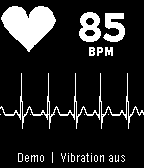
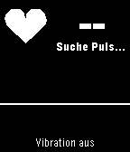
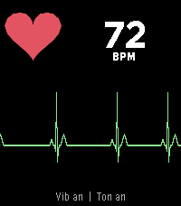

# Pulsmonitor für Pebble 2

Eine kleine Watchapp, die den Herzschlag der Pebble 2 (und der neuen Core-Devices-Uhren)
**grafisch** und **akustisch** darstellt.

| Pebble 2 (schwarz/weiß) | Suche nach Puls | Core Time 2 (Farbe, Lautsprecher) |
| --- | --- | --- |
|  |  |  |

## Was die App macht

- Liest den optischen Pulssensor über die Health-API (`HealthMetricHeartRateBPM`, Fallback
  `HealthMetricHeartRateRawBPM`) und fordert eine Abtastrate von 1 s an.
- Zeigt den Puls groß in BPM an, daneben ein Herz, das bei jedem Schlag pumpt.
- Zeichnet darunter eine laufende EKG-artige Kurve (P-QRS-T), die pro Schlag einen Ausschlag bekommt.
- Gibt jeden Schlag akustisch wieder:
  - **Pebble 2:** kurzer Vibrations-Klick (30 ms), die Uhr hat keinen Lautsprecher.
  - **Core Time 2 / Core 2 Duo:** zusätzlich ein kurzer Monitor-Piep (880 Hz) über den Lautsprecher.
    Ist die Uhr stummgeschaltet (Quiet Time / Sounds), bleibt der Piep aus.
- Kommt 15 s lang kein gültiger Wert, zeigt die App wieder `--` und „Suche Puls...“.
- Beim Beenden wird die angeforderte Abtastrate zurückgesetzt, damit der Akku geschont wird.

Der Sensor liefert nur Schläge pro Minute, keine einzelnen Schläge. Die Schläge werden deshalb im
gemessenen Takt synthetisiert; die Kurve ist eine Visualisierung, kein medizinisches EKG.

## Bedienung

| Taste | Funktion |
| --- | --- |
| SELECT | Vibrations-Klick an/aus |
| UP | Piep an/aus (nur Uhren mit Lautsprecher) |
| DOWN lang | Demo-Modus an/aus (simulierter Puls 58–112 BPM, z. B. für den Emulator) |
| BACK | Beenden |

Die Einstellungen für Vibration und Ton werden gespeichert.

Hinweis: Der Vibrationsmotor kann den optischen Sensor kurz stören. Wenn die Messung unruhig wird,
die Vibration mit SELECT ausschalten.

## Bauen und installieren

Voraussetzung ist das aktuelle Pebble-SDK von Core Devices:

```sh
uv tool install pebble-tool      # oder: pip install pebble-tool
pebble sdk install latest
```

Dann im Projektordner:

```sh
cd pebble/heart-rate
pebble build
pebble install --phone <IP der Pebble-App>    # auf die Uhr
pebble install --emulator diorite             # oder im Emulator (Pebble 2)
```

Die fertige Datei liegt danach unter `build/heart-rate.pbw` und kann auch direkt über die
Pebble-App aufs Handy geschickt und installiert werden.

Im Emulator lässt sich ein Puls simulieren (funktioniert mit der neueren Firmware, z. B. `emery`):

```sh
pebble emu-heart-rate --emulator emery 72
```

Auf der alten Pebble-2-Emulator-Firmware hilft stattdessen der Demo-Modus (DOWN lang drücken,
im Emulator: `pebble emu-button --emulator diorite push down`, kurz warten, `... release down`).

## Zielplattformen

`diorite` (Pebble 2), `emery` (Core Time 2), `flint` (Core 2 Duo), `gabbro` (rund, Core Devices).
Alle vier werden mit `pebble build` in einem Rutsch gebaut.
